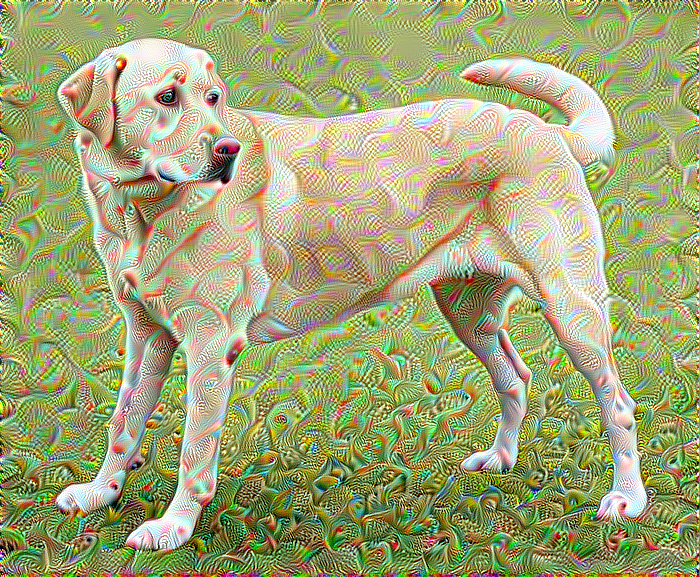

# DeepDream

- DeepDream is an experiment that visualizes the patterns learned by a neural network. It does so by forwarding an image through the network, then calculating the gradient of the image with respect to the activations of a particular layer. <b>The image is then modified to increase these activations</b>, enhancing the patterns seen by the network, and resulting in a dream-like image. This process was dubbed "Inceptionism" (a reference to [InceptionNet](https://arxiv.org/pdf/1409.4842.pdf), and the [movie](https://en.wikipedia.org/wiki/Inception) Inception).


## Usage

- To use the code, you need to have PyTorch installed. You can install it using the following command:
```bash
pip install torch torchvision
```

- Import the required modules:
```python

import torch

from torchvision.models import inception_v3, Inception_V3_Weights  # You can import your own model

from deepdream.deepdream import ObjectiveHook, DeepDream

from deepdream.deepdream.helper_functions.utils import img_to_tensor
```


- You can then make the objective of the different layers of the network to see what that layer is looking for in the image. 
```python

model = inception_v3((weights=Inception_V3_Weights.IMAGENET1K_V1)

mixed_3 = ["Conv2d_3b_1x1"]
mixed_5 = ["Mixed_5b", "Mixed_5c", "Mixed_5d"]

# layers_to_hook = mixed_3 + mixed_5, here you can multiply the objective of the layers by a factor to give more importance to one layer over the other

with torch.no_grad():
    objective_1 = ObjectiveHook(model, mixed_3, device)
    objective_2 = ObjectiveHook(model, mixed_5, device)

    objective = objective_1 + objective_2

# Clean up
del objective_1
del objective_2
torch.cuda.empty_cache()

```

- You can then use the `DeepDream` class to generate the dream-like image. 
```python

initial_img = img_to_tensor("deepdream/data/YellowLabradorLooking_new.jpg")

deep_dream = DeepDream(initial_img, objective, device)

dream_image = deep_dream.run( 
    iterations=100, 
    lr=0.01, 
    display_interval=32, 
)

```

- The output images are saved in the `dreamed_images` folder from which you can create a .gif file to see the evolution of the image.

```python

from deepdream.deepdream.helper_functions.utils import create_animation

to_display_imgs = [img_to_tensor(f"dreamed_images/{i}.jpg") for i in range(0, 100, 2)]

create_animation(to_display_imgs, "dreamed_image.gif", fps=10, title="Dreamed Image", denormalize=True)

```

## Results

- The following images are the results of the DeepDream algorithm. The first image is the original image, and the second image is the dreamed image.

<!-- add both the images side by side using html at centre-->

<p align="center">
  
  
</p>

- You can create a .gif file to see the evolution of the image.

```python
from deepdream.helper_function.utils import create_animation, img_to_tensor
import os
import torch

all_dreamed_imgs = os.listdir("dreamed_images/")
to_display_imgs = [
    img_to_tensor(f"dreamed_images/{i}", normalize=False) for i in all_dreamed_imgs
]


concatenated_imgs = torch.cat(to_display_imgs, dim=0)

create_animation(
    concatenated_imgs,
    "dreamed_image.gif",
    fps=5,
    title="Dreamed Image",
    denormalize=True,  # True when the image is between -1 and 1 (mostly after model output)
)

```

- The following is the .gif file of the dreamed image.


## References

- [DeepDream](https://ai.googleblog.com/2015/06/inceptionism-going-deeper-into-neural.html)

- [TensorFlow tutorial](https://www.tensorflow.org/tutorials/generative/deepdream)

- [InceptionNet](https://arxiv.org/pdf/1409.4842.pdf)

- [Inception (movie)](https://en.wikipedia.org/wiki/Inception)